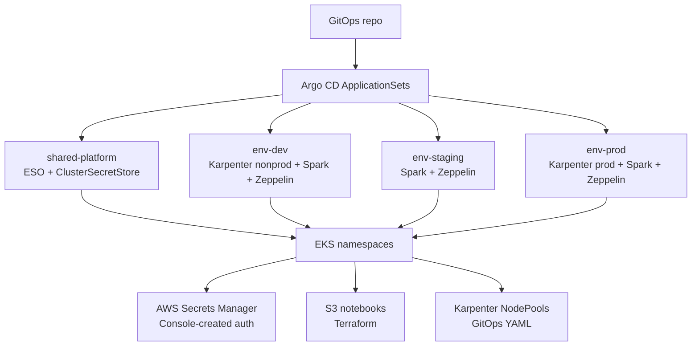
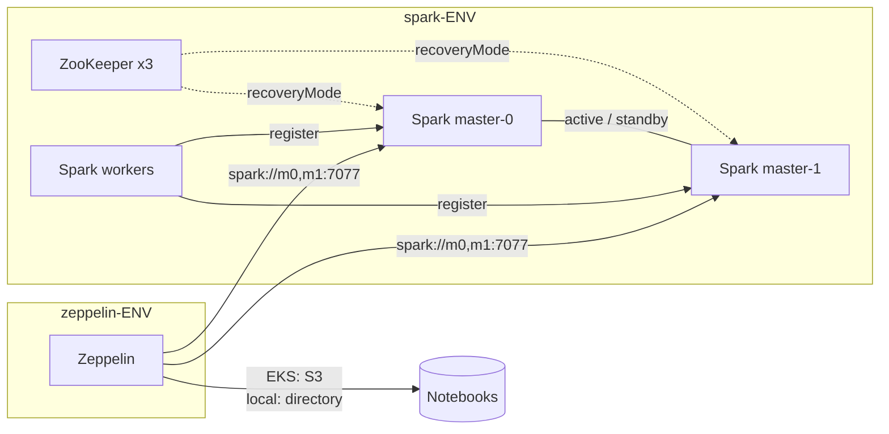
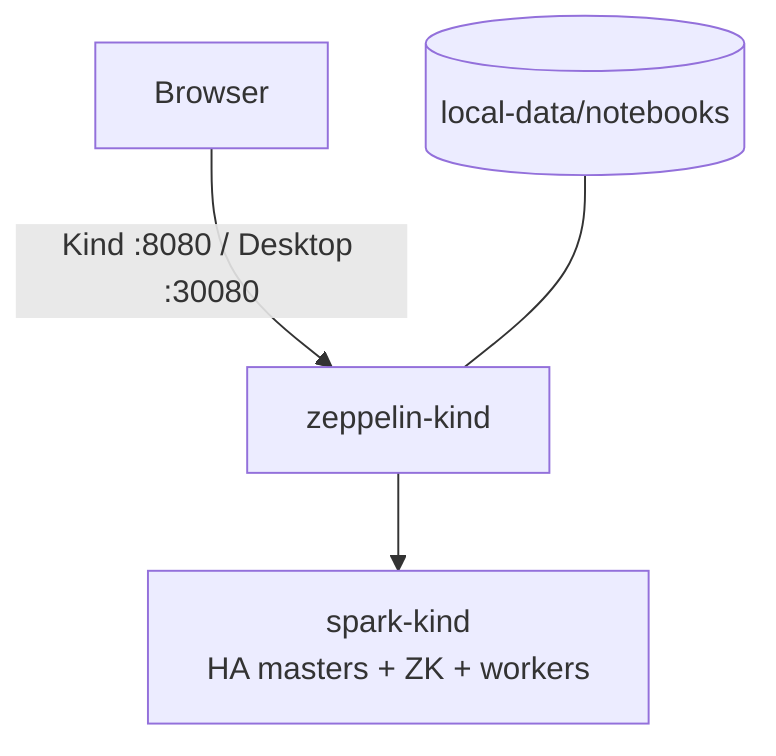

# Zeppelin + Spark on EKS (GitOps)

GitOps repository for highly available **Apache Zeppelin** and **Spark Standalone**
(master + workers, optional ZooKeeper HA) on an existing Amazon EKS cluster.

Provision AWS with **Terraform** (S3 + IRSA), create **app** secrets in the **AWS Console**,
deploy with **Helm + Argo CD ApplicationSets**, and schedule onto **Karpenter** NodePools.

## Stack

| Layer | What we use |
|-------|-------------|
| **Terraform** | S3 notebooks bucket + IRSA roles (`terraform/`) — auth secrets are manual |
| **Helm** | Zeppelin + **Spark Standalone** (`charts/spark-cluster`); External Secrets chart |
| **Argo CD** | Per-env ApplicationSets (`dev` / `staging` / `prod`) + shared platform; `goTemplate: true` |
| **External Secrets** | Syncs Console-created `zeppelin/<env>/app` → K8s Secret (env vars) |
| **Karpenter** | Dedicated NodeClasses/NodePools for Zeppelin and Spark |
| **IRSA** | Pods assume IAM roles for S3 and Secrets Manager (no static AWS keys in Git) |

## Repository layout

```text
terraform/                     AWS: S3 + IRSA (auth secrets are manual)
  README.md                    Outputs → GitOps wiring
  terraform.tfvars.example

charts/zeppelin/               HA Zeppelin Helm chart
charts/spark-cluster/          Spark Standalone (+ optional HA masters + ZooKeeper)
apps/zeppelin/                 values-dev | staging | prod | kind
apps/spark-cluster/            Spark cluster values per env (HA on for EKS envs)

platform/
  external-secrets/            ESO Helm values (IRSA annotation)
  cluster-secret-store/        ClusterSecretStore → AWS Secrets Manager
  karpenter/
    nonprod/                   EC2NodeClass + Zeppelin/Spark NodePools (small)
    prod/                      EC2NodeClass + Zeppelin / driver / executor pools

argocd/
  projects/zeppelin.yaml       AppProject allow-list
  applicationsets/
    shared-platform-appset.yaml   ESO + ClusterSecretStore only
    env-dev-appset.yaml           Karpenter nonprod + Spark + Zeppelin
    env-staging-appset.yaml       Spark + Zeppelin (shares nonprod nodes)
    env-prod-appset.yaml          Karpenter prod + Spark + Zeppelin

iam/                           Reference IAM JSON (Terraform is preferred)
hack/                          kind-up.sh, docker-desktop-up.sh, kind-config
local-data/notebooks/          Local VFS notebooks (gitignored contents)
docs/
  bootstrap.md                 End-to-end bootstrap
  spark-standalone.md          Spark chart, HA + ZooKeeper
  karpenter.md                 NodeClass / NodePool design
  argo-applicationsets.md      ApplicationSet + goTemplate primer
  secrets-convention.md        Local K8s Secret vs AWS SM + ESO
  network-policies.md          NetworkPolicy knobs for Zeppelin + Spark
  kind-local.md                Local Kind or Docker Desktop (no AWS)
```

## Architecture

### GitOps on EKS



### Runtime (all envs: local + EKS)

Same Spark HA topology everywhere. Notebook storage differs: **local directory** vs **S3**.



| Env | Spark HA + ZK | Notebooks | Relative size |
|-----|---------------|-----------|---------------|
| **kind** / Docker Desktop | yes | `local-data/notebooks` (VFS) | smallest |
| **dev** | yes | S3 | smaller nonprod |
| **staging** | yes | S3 | medium |
| **prod** | yes | S3 | full |

### Local laptop (Kind or Docker Desktop)



**Highlights**

- Same architecture locally and on EKS: **HA Spark + ZooKeeper** + Zeppelin client mode.
- EKS notebooks on **S3**; local notebooks on **`local-data/notebooks`** (hostPath).
- Spark is **Standalone** (`charts/spark-cluster`) — **no Spark Operator / CRDs**.
- **Non-prod / prod** sizing and Karpenter NodePools differ; topology does not.
- Each EKS environment has its **own** ApplicationSet.
- UI: **no Shiro** (anonymous). App credentials: **local K8s Secret** or **AWS Secrets Manager** (EKS).

## Prerequisites

**EKS**

- Existing **EKS** cluster with IAM OIDC provider
- **Argo CD** installed (`argocd` namespace)
- **Karpenter** v1 CRDs + controller on the cluster
- **AWS Load Balancer Controller** (ALB Ingress)
- Terraform `>= 1.5`, kubectl, AWS CLI, Helm

**Local**

- **Kind** *or* **Docker Desktop** with Kubernetes enabled
- kubectl, Helm

## Quick start (local — no AWS)

Same HA architecture as EKS; notebooks under `local-data/notebooks/`.

### Option A — Kind

```bash
./hack/kind-up.sh
# UI http://localhost:8080  (no login)
# Notebooks: ./local-data/notebooks
```

### Option B — Docker Desktop Kubernetes

```bash
./hack/docker-desktop-up.sh
# UI http://localhost:30080
# Notebooks: ./local-data/notebooks
```

Full details: [docs/kind-local.md](docs/kind-local.md). Spark: [docs/spark-standalone.md](docs/spark-standalone.md).

### Local secrets — what to create

**Nothing is required** to bring the stack up. The UI is anonymous; notebooks live on disk under `local-data/notebooks/`.

| Secret | Required? | What / where |
|--------|-----------|--------------|
| *(none)* | — | Default `apps/zeppelin/values-kind.yaml` has `appSecrets.enabled: false` |
| `zeppelin-app` | **Optional** | Only if you need API keys / DB passwords as env vars in the Zeppelin pod |

**Optional app secret**

```bash
# 1) Create Secret in namespace zeppelin-kind (key=value → env vars)
./hack/create-local-app-secret.sh MY_API_TOKEN=dev-token JDBC_PASSWORD=local

# or edit local-data/app.env then:
./hack/create-local-app-secret.sh --from-env-file local-data/app.env

# 2) Turn it on in apps/zeppelin/values-kind.yaml
#    appSecrets:
#      enabled: true
#      secretName: zeppelin-app
#      source: existing
#      envFrom: true

# 3) Re-apply Zeppelin
helm upgrade --install zeppelin charts/zeppelin \
  -n zeppelin-kind -f apps/zeppelin/values-kind.yaml \
  --set service.type=NodePort --set-string service.nodePort=30080
```

| Field | Value |
|-------|--------|
| Namespace | `zeppelin-kind` |
| Secret name | `zeppelin-app` |
| Keys | Whatever you need (become env vars) |
| File (optional) | `local-data/app.env` (gitignored) |

Full convention (local + EKS): [docs/secrets-convention.md](docs/secrets-convention.md).

## Quick start (EKS)

### 1. Provision AWS (Terraform)

```bash
cd terraform
cp terraform.tfvars.example terraform.tfvars   # set region, cluster name, bucket name
terraform init
terraform apply
```

**Passwords / auth**

Create Secrets Manager secrets in the **AWS Console** (`zeppelin/<env>/app`, arbitrary JSON keys → env vars).
Terraform only outputs the expected names via `manual_secrets_manager_names`.

Copy infra outputs into GitOps values:

```bash
terraform output gitops_placeholder_hints
terraform output external_secrets_role_arn
terraform output -json zeppelin_role_arns
terraform output notebook_bucket_name
```

Details: [terraform/README.md](terraform/README.md).

### 2. Fill remaining placeholders

Search the repo for `REPLACE_ME_` and set at least:

| Placeholder | Used for |
|-------------|----------|
| `REPLACE_ME_GITOPS_REPO_URL` | Argo ApplicationSets |
| `REPLACE_ME_NOTEBOOK_BUCKET` / role ARNs | Helm values (or use Terraform outputs) |
| `REPLACE_ME_CLUSTER_NAME` | Karpenter subnet/SG discovery tags |
| `REPLACE_ME_AZ_A/B/C` | Prod NodePool zones |
| `REPLACE_ME_KARPENTER_NODE_ROLE` | EC2NodeClass instance profile role |
| Ingress host + ACM cert | `apps/zeppelin/values-*.yaml` |

### 3. Push and register the repo with Argo CD

Point Argo CD at this Git repository (`main` or your default branch).

### 4. Apply AppProject + ApplicationSets

```bash
kubectl apply -f argocd/projects/zeppelin.yaml
kubectl apply -f argocd/applicationsets/shared-platform-appset.yaml
kubectl apply -f argocd/applicationsets/env-dev-appset.yaml
kubectl apply -f argocd/applicationsets/env-staging-appset.yaml
kubectl apply -f argocd/applicationsets/env-prod-appset.yaml
```

**Sync waves (rough order):** Karpenter (−1) → External Secrets (0) → ClusterSecretStore (1) → Spark Standalone (2) → Zeppelin (3).

### 5. Verify

```bash
kubectl get applicationsets -n argocd
kubectl get applications -n argocd -l app.kubernetes.io/part-of=zeppelin-platform
kubectl get pods -n zeppelin-dev
kubectl get pods -n spark-dev
kubectl get ingress -n zeppelin-dev
kubectl get nodepool
```

Open the Ingress host for your environment (anonymous UI). App secrets come from Secrets Manager via ESO.

Optional Spark smoke test (pick an active master pod when HA is on):

```bash
kubectl -n spark-dev port-forward pod/spark-master-0 8080:8080
# open http://localhost:8080 — workers should appear on the active master
```

## Environments

| Env | ApplicationSet | Zeppelin ns | Spark ns | Spark mode | Notebooks | Karpenter |
|-----|----------------|-------------|----------|------------|-----------|-----------|
| **kind** / Docker Desktop | (Helm only) | `zeppelin-kind` | `spark-kind` | HA + ZK | local dir | n/a |
| **dev** | `zeppelin-env-dev` | `zeppelin-dev` | `spark-dev` | HA + ZK (small) | S3 | Owns **nonprod** |
| **staging** | `zeppelin-env-staging` | `zeppelin-staging` | `spark-staging` | HA + ZK | S3 | Reuses nonprod |
| **prod** | `zeppelin-env-prod` | `zeppelin-prod` | `spark-prod` | HA + ZK | S3 | Owns **prod** |

Shared (all EKS envs): ApplicationSet `zeppelin-shared-platform` → External Secrets, ClusterSecretStore.

## Documentation

| Doc | Topic |
|-----|--------|
| [docs/bootstrap.md](docs/bootstrap.md) | Full bootstrap checklist (Terraform + Argo + manual CLI fallback) |
| [terraform/README.md](terraform/README.md) | S3 + IRSA; auth secrets are manual (AWS Console) |
| [docs/karpenter.md](docs/karpenter.md) | EC2NodeClass / NodePool sizing and taints |
| [docs/argo-applicationsets.md](docs/argo-applicationsets.md) | ApplicationSet anatomy + Go template primer |
| [docs/secrets-convention.md](docs/secrets-convention.md) | Local K8s Secret vs AWS SM + External Secrets |
| [docs/network-policies.md](docs/network-policies.md) | Configurable NetworkPolicies for Zeppelin + Spark pods |
| [docs/spark-standalone.md](docs/spark-standalone.md) | Spark Standalone chart, HA + ZooKeeper |
| [docs/kind-local.md](docs/kind-local.md) | Local Kind or Docker Desktop smoke test (no AWS) |

ApplicationSet YAML under `argocd/applicationsets/` is heavily commented for teams new to Argo CD.

## Out of scope (v1)

- Creating the EKS cluster itself
- Karpenter controller / node IAM instance role install
- Spark History Server, YuniKorn, Karpenter NodePool autoscaling beyond what’s in `platform/karpenter/`
- Full Prometheus / Grafana stack

## License

Internal platform config — adjust for your organization.
