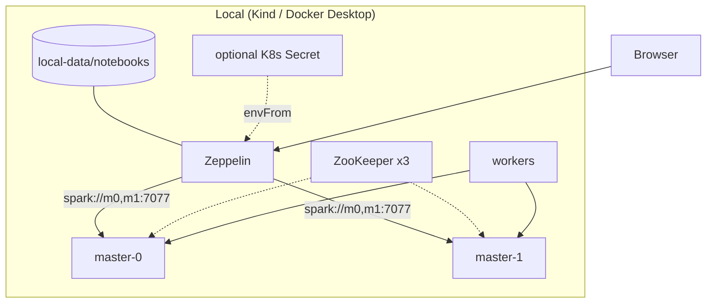

# Local Kubernetes (Kind or Docker Desktop)

Same architecture as EKS **dev / staging / prod**:

| Layer | Local | EKS |
|-------|-------|-----|
| Spark | HA: 2 masters + ZooKeeper + workers | Same |
| Zeppelin | Client mode → comma-separated master URL | Same |
| Notebooks | **Local directory** (VFS hostPath) | S3 |
| UI auth | None (anonymous) | None (anonymous) |
| App secrets | Optional local K8s Secret | Secrets Manager → ESO |
| Nodes | Kind / Docker Desktop | Karpenter |
| Ingress | NodePort | ALB |



## App secrets (optional)

```bash
./hack/create-local-app-secret.sh
# edit local-data/app.env, re-run, then set appSecrets.enabled=true
```

See [secrets-convention.md](secrets-convention.md).

## Option A — Kind

```bash
./hack/kind-up.sh
# UI: http://localhost:8080  (no login)
# Notebooks on host: ./local-data/notebooks
```

Tear down: `kind delete cluster --name zeppelin`

## Option B — Docker Desktop Kubernetes

```bash
./hack/docker-desktop-up.sh
# UI: http://localhost:30080
```

## Notebooks directory

| Setting | Value |
|---------|--------|
| Host path | `local-data/notebooks/` |
| In-pod path | `/opt/zeppelin/notebook` |
| Kind node path | `/zeppelin-notebooks` |

Override: `NOTEBOOKS_HOST_DIR=/path/to/dir ./hack/kind-up.sh`

## Memory

HA needs roughly **8GB+** RAM for the VM/Docker Desktop.

## Values

- `apps/spark-cluster/values-kind.yaml` — HA on, small resources, ZK emptyDir
- `apps/zeppelin/values-kind.yaml` — VFS + hostPath, anonymous, HA Spark URL

See [spark-standalone.md](spark-standalone.md).
