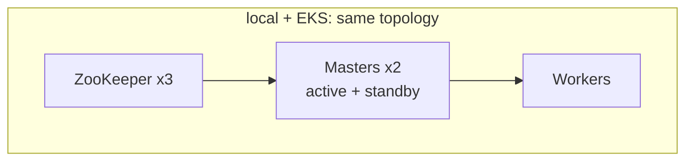

# Spark Standalone (no Operator)

Apache Spark in classic standalone mode (master + workers), with optional
ZooKeeper HA — used the **same way** on local Kind/Docker Desktop and on EKS.

| Component | Chart | Role |
|-----------|--------|------|
| Master | `charts/spark-cluster` | Port `7077`, UI `8080` |
| Workers | same chart | Register with masters; run executors |
| ZooKeeper | same chart (`ha.enabled`) | Leader election / recovery |
| Zeppelin | `charts/zeppelin` | Client: comma-separated `spark://…` URL |

## Modes



| Env | HA | ZooKeeper PVC | Notebooks | Sizing |
|-----|----|---------------|-----------|--------|
| `kind` / Docker Desktop | on | emptyDir | `local-data/notebooks` | smallest |
| `dev` | on | small PVC | S3 | smaller nonprod |
| `staging` | on | PVC | S3 | medium |
| `prod` | on | PVC | S3 | full |

```yaml
ha:
  enabled: true
  masters: 2
  zookeeper:
    replicaCount: 3
    persistence:
      enabled: true   # false on Kind
      size: 10Gi
```

Master URL pattern:

```text
spark://spark-master-0.spark-master-hs.<ns>.svc.cluster.local:7077,spark-master-1.spark-master-hs.<ns>.svc.cluster.local:7077
```

## Install

```bash
# EKS-style (e.g. dev)
helm upgrade --install spark charts/spark-cluster \
  --namespace spark-dev --create-namespace \
  -f apps/spark-cluster/values-dev.yaml

# Local (same HA chart values)
./hack/kind-up.sh
# or: ./hack/docker-desktop-up.sh
```

## Production notes

- Pin image tags; size workers to Karpenter pools on EKS.
- Keep ZK on durable storage in EKS (`persistence.enabled: true`).
- Active master UI: port-forward `pod/spark-master-0` (or `-1`), not a random ClusterIP.
- Local details: [kind-local.md](kind-local.md).
